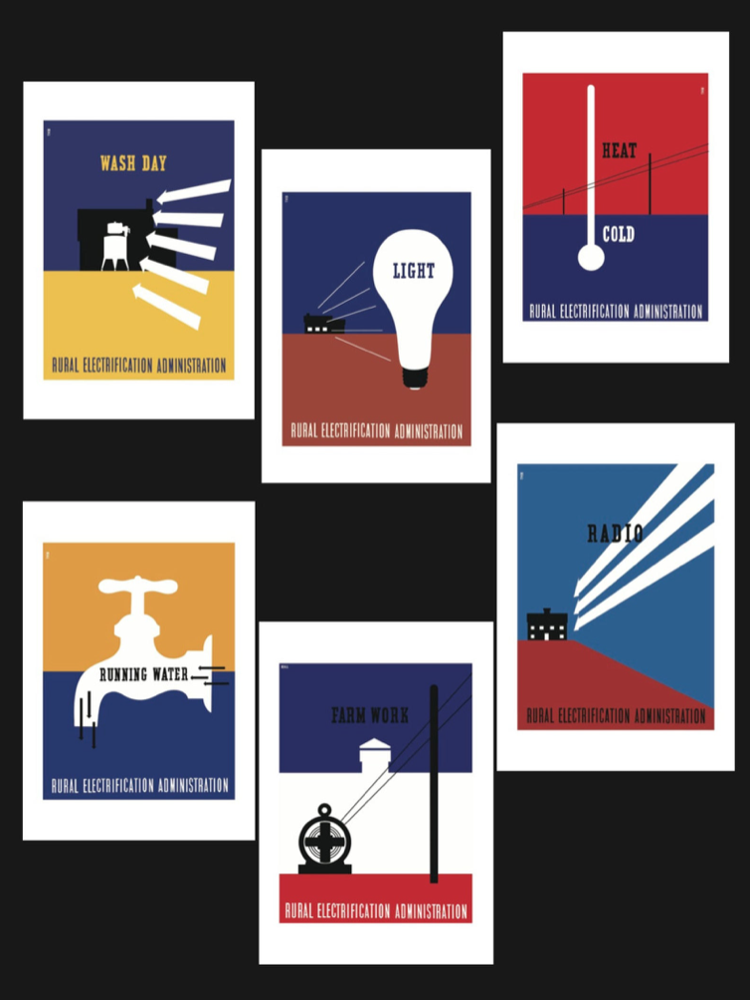

# LIGHT
Poster

link: https://bollena001.github.io/LIGHT/.

In 1935 werd door President Roosevelt the Rural Electrification Administration(REA) bedacht. Het doel van the REA was om elektriciteit naar het platteland van Amerika te brengen. Veel steden in 1935 hadden al electriciteit maar minder dan 11 van de 100 boerderijen kregen elektriciteit van de central station electric service en dit kwam omdat de elektriciteitsbedrijven niet bereid waren om kabels te leggen naar het platteland en terug voor een betaalbare prijs.

The REA huurde graphic designer Lester Beall in om een serie posters te maken met daarop de voordelen van electrisering. Ook wilde Beall de boodschap: <i>"bringing a bright and shiny future to the youth of America, (particularly those wholesome youth still down on the farm"</i> meegeven met de posters.

Bronnen:
https://fsymbols.com/signs/sun/
  https://codepen.io/HarlemSquirrel/pen/NdMebZ
  https://proto.io/freebies/onoff/
  https://codepen.io/KevinOgden/pen/JEwjBB
  https://livingnewdeal.org/glossary/rural-electrification-administration-rea-1935/
  https://www.moma.org/explore/inside_out/2012/03/22/lester-beall-and-the-rural-electrification-administration/
  https://www.rit.edu/press/lester-beall-poster-light
  https://www.etsy.com/listing/162107572/all-6-lester-beall-rural-electrification
  https://www.visitthecapitol.gov/exhibitions/artifact/light-rural-electrification-administration-nd

